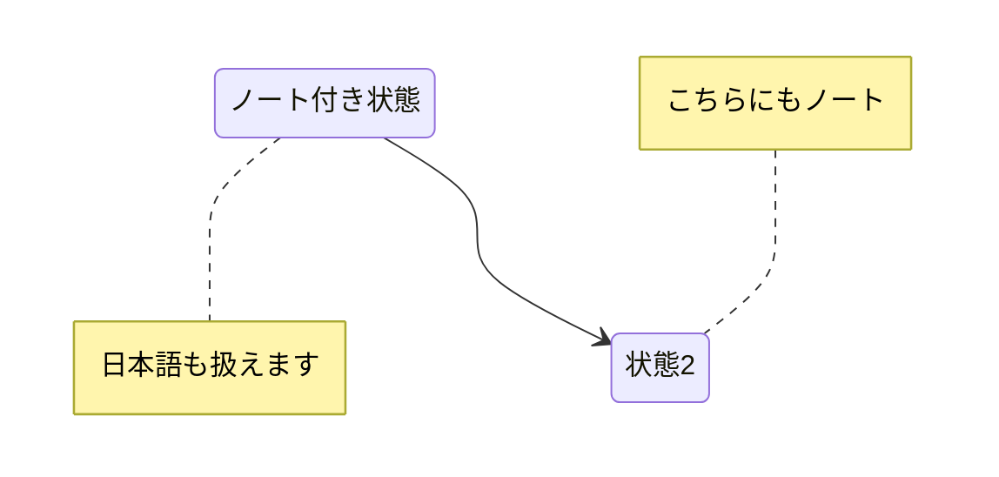

---
script:
  - type: 'text/javascript'
    src: './scripts/mermaid.min.js'
  - type: 'text/javascript'
    src: './scripts/vs-mermaid.js'
    defer: true
---

# mermaid.js サンプル

````markdown

````


````markdown

````

