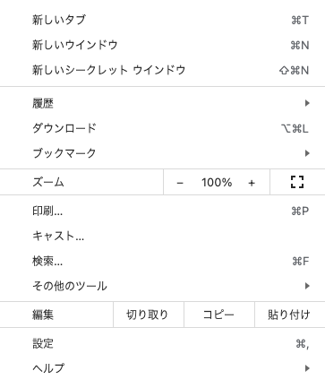

---
script:
  - type: 'text/javascript'
    src:  './scripts/snap.svg-min.js'
    defer: true
  - type: 'text/javascript'
    src: './scripts/vs-notation.js'
    defer: true
---

# 画像への注記

````markdown

```image-notation
<-{"x1":0,"y1":0,"x2":300,"y2":400,"stroke":"gray"}
<@{"x":40,"y":30,"char":"A"}
<@{"x":140,"y":130,"char":"B"}
<@{"x":140,"y":230,"char":"あ", "angle":40,"stroke":"orange"}
[]{"x":20, "y":10, "stroke":"blue"}
(){"cx":70,"cy":270,"rx":60,"ry":45,"stroke":"#887766","strokeWidth":3}
```
````


```image-notation
<-{"x1":0,"y1":0,"x2":300,"y2":400,"stroke":"gray"}
<@{"x":40,"y":30,"char":"A"}
<@{"x":140,"y":130,"char":"B"}
<@{"x":140,"y":230,"char":"あ", "angle":40,"stroke":"orange"}
[]{"x":20, "y":10, "stroke":"blue"}
(){"cx":70,"cy":270,"rx":60,"ry":45,"stroke":"#887766","strokeWidth":3}
```